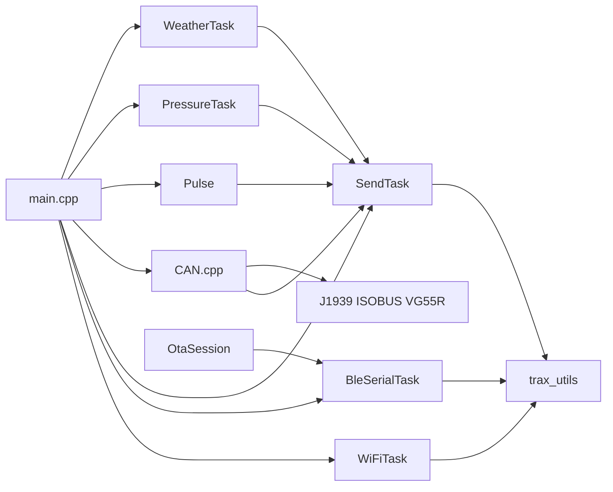
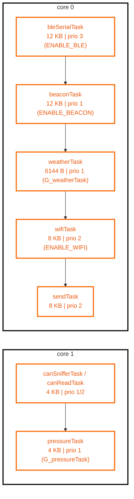
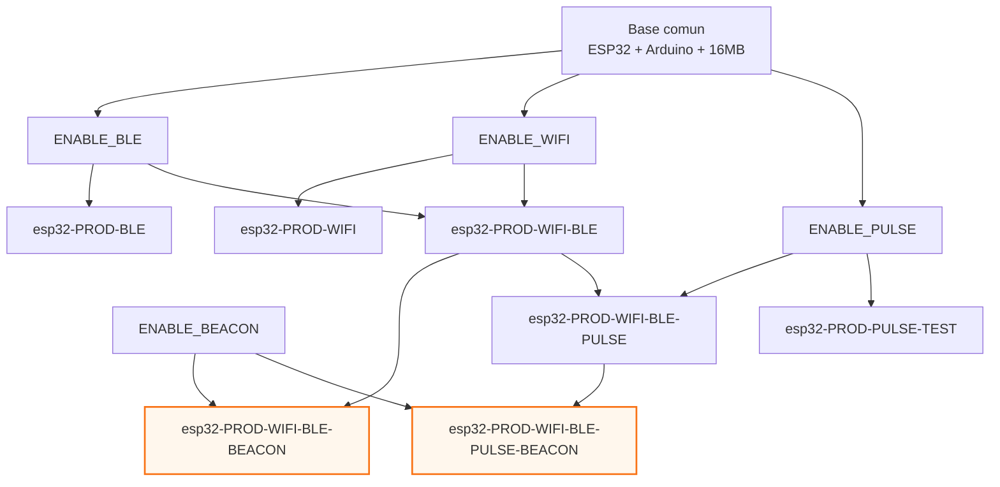
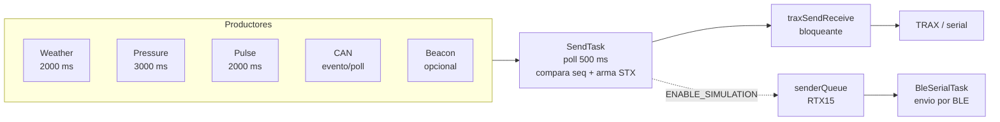

<p align="center">
  
</p>

# AGX Compact ESP32

Firmware para ESP32 orientado a adquisicion de datos y telemetria, con integracion de sensores, CAN (J1939/ISOBUS/VG55R), puentes BLE/WiFi y OTA por BLE.

[](platformio.ini) [](platformio.ini) [](docs/02_build_deploy_test.md) [](docs/02_build_deploy_test.md) [](docs/03_protocols_and_messages.md) [](docs/03_protocols_and_messages.md) [](docs/03_protocols_and_messages.md) [](docs/README.md) [](docs/README.md)

## Tabla de contenidos

- [Quickstart](#quickstart)
- [Documentacion Tecnica Integrada](#documentacion-tecnica-integrada)
- [Arquitectura del firmware](#arquitectura-del-firmware)
  - [1. Vista por capas](#1-vista-por-capas)
  - [2. Diagrama de bloques](#2-diagrama-de-bloques)
  - [3. Tareas por core](#3-tareas-por-core)
  - [4. Flujo de datos salientes (actual)](#4-flujo-de-datos-salientes-actual)
  - [5. Sincronizacion y concurrencia](#5-sincronizacion-y-concurrencia)
  - [6. Mapa de modulos clave](#6-mapa-de-modulos-clave)
  - [7. Principios operativos para mantenimiento](#7-principios-operativos-para-mantenimiento)
- [Modulos explicados](#modulos-explicados)
  - [1. Orquestacion (main)](#1-orquestacion-main)
  - [2. SendTask](#2-sendtask)
  - [3. Weather](#3-weather)
  - [4. Pressure](#4-pressure)
  - [5. Pulse](#5-pulse)
  - [6. CAN core](#6-can-core)
  - [7. Protocolos J1939 ISOBUS VG55R](#7-protocolos-j1939-isobus-vg55r)
  - [8. BleSerialTask](#8-bleserialtask)
  - [9. WiFiTask](#9-wifitask)
  - [10. trax_utils](#10-traxutils)
  - [11. Messanger_queue](#11-messangerqueue)
  - [12. OtaSession](#12-otasession)
- [Build, deploy y test](#build-deploy-y-test)
  - [1. Requisitos](#1-requisitos)
  - [2. Entornos PlatformIO (reales)](#2-entornos-platformio-reales)
  - [3. Comandos base](#3-comandos-base)
  - [4. OTA por BLE](#4-ota-por-ble)
  - [5. Pruebas](#5-pruebas)
  - [6. Analisis estatico de codigo (mejora futura)](#6-analisis-estatico-de-codigo-mejora-futura)
  - [7. Troubleshooting rapido](#7-troubleshooting-rapido)
  - [8. Checklist de release tecnica](#8-checklist-de-release-tecnica)
- [Protocolos y formatos de mensaje](#protocolos-y-formatos-de-mensaje)
  - [1. Canal TRAX](#1-canal-trax)
  - [2. Mensajes salientes construidos por SendTask](#2-mensajes-salientes-construidos-por-sendtask)
  - [2.1 Clima](#21-clima)
  - [2.2 Presion](#22-presion)
  - [2.3 Pulsos](#23-pulsos)
  - [2.4 CAN J1939](#24-can-j1939)
  - [2.5 CAN ISOBUS](#25-can-isobus)
  - [2.6 VG55R](#26-vg55r)
  - [2.7 Beacon](#27-beacon)
  - [3. Protocolo OTA BLE](#3-protocolo-ota-ble)
  - [4. Comandos especiales](#4-comandos-especiales)
  - [5. Reglas para agregar un mensaje nuevo](#5-reglas-para-agregar-un-mensaje-nuevo)
- [Hardware, buses y flags de compilacion](#hardware-buses-y-flags-de-compilacion)
  - [1. Mapa de pines relevantes](#1-mapa-de-pines-relevantes)
  - [1.1 CAN MCP2515 (VSPI)](#11-can-mcp2515-vspi)
  - [1.2 Pulsos](#12-pulsos)
  - [1.3 Serial hacia TRAX](#13-serial-hacia-trax)
  - [2. Flags de compilacion principales](#2-flags-de-compilacion-principales)
  - [2.1 Flags funcionales](#21-flags-funcionales)
  - [2.2 Flags tecnicas](#22-flags-tecnicas)
  - [3. Relacion flags vs entornos](#3-relacion-flags-vs-entornos)
  - [4. Buenas practicas de hardware](#4-buenas-practicas-de-hardware)
  - [5. Checklist de integracion rapida](#5-checklist-de-integracion-rapida)
- [Flujo actual de mensajeria (estado presente)](#flujo-actual-de-mensajeria-estado-presente)
  - [1. Patron vigente](#1-patron-vigente)
  - [2. Productores y contratos](#2-productores-y-contratos)
  - [2.1 Weather](#21-weather)
  - [2.2 Pressure](#22-pressure)
  - [2.3 Pulse](#23-pulse)
  - [2.4 CAN (J1939, ISOBUS, VG55R)](#24-can-j1939-isobus-vg55r)
  - [2.5 Beacon](#25-beacon)
  - [3. Agregacion y envio](#3-agregacion-y-envio)
  - [4. Uso actual de Messanger_queue](#4-uso-actual-de-messangerqueue)
  - [5. Limitaciones observadas](#5-limitaciones-observadas)
  - [6. Implicancias para roadmap](#6-implicancias-para-roadmap)
- [RFC: Cola centralizada de mensajes salientes](#rfc-cola-centralizada-de-mensajes-salientes)
  - [1. Problema actual](#1-problema-actual)
  - [2. Objetivos](#2-objetivos)
  - [3. No objetivos](#3-no-objetivos)
  - [4. Diseño propuesto](#4-diseno-propuesto)
  - [4.1 Envelope de mensaje](#41-envelope-de-mensaje)
  - [4.2 Topologia de colas](#42-topologia-de-colas)
  - [4.3 Interfaz minima](#43-interfaz-minima)
  - [5. Politicas requeridas](#5-politicas-requeridas)
  - [5.1 Orden](#51-orden)
  - [5.2 Backpressure y overflow](#52-backpressure-y-overflow)
  - [5.3 Retry](#53-retry)
  - [5.4 Freshness](#54-freshness)
  - [5.5 Mensajes compuestos](#55-mensajes-compuestos)
  - [6. Observabilidad](#6-observabilidad)
  - [7. Compatibilidad y migracion](#7-compatibilidad-y-migracion)
  - [Fase 0: Baseline](#fase-0-baseline)
  - [Fase 1: Infra cola](#fase-1-infra-cola)
  - [Fase 2: Migracion progresiva](#fase-2-migracion-progresiva)
  - [Fase 3: Consolidacion](#fase-3-consolidacion)
  - [8. Criterios de aceptacion](#8-criterios-de-aceptacion)
  - [9. Riesgos y mitigaciones](#9-riesgos-y-mitigaciones)
  - [10. Decisiones iniciales recomendadas (MVP)](#10-decisiones-iniciales-recomendadas-mvp)
  - [11. Relacion con implementacion actual](#11-relacion-con-implementacion-actual)
- [TODO del proyecto](#todo-del-proyecto)
  - [1. Documentacion](#1-documentacion)
  - [2. Arquitectura de mensajeria](#2-arquitectura-de-mensajeria)
  - [3. Confiabilidad y telemetria](#3-confiabilidad-y-telemetria)
  - [4. Testing](#4-testing)
- [Equipo y contribuyentes](#equipo-y-contribuyentes)

> [!IMPORTANT]
> Este README se genera automaticamente desde documentos modulares en `docs/`. No editar manualmente secciones integradas.
> Regenerar: `powershell -ExecutionPolicy Bypass -File scripts/build_readme.ps1`.

## Quickstart

```bash
pip install -r requirements.txt
pio run -e esp32-PROD-BLE
pio run --target upload -e esp32-PROD-BLE --upload-port COM7
pio device monitor -e esp32-PROD-BLE --port COM7
```

## Documentacion Tecnica Integrada

<!-- BEGIN: docs/01_architecture.md -->
## Arquitectura del firmware

Este documento describe la arquitectura real del firmware segun el codigo actual.

### 1. Vista por capas

1. Entrada y orquestacion
- `src/main.cpp` crea tareas FreeRTOS, inicializa serial/BLE y colas, y decide que tareas se habilitan por flags de compilacion.

2. Adquisicion de datos
- `src/WeatherTask.cpp` (clima + GPS via TRAX)
- `src/PressureTask.cpp` (sensor de presion)
- `src/Pulse.cpp` (contadores por ISR)
- `src/CAN/CAN.cpp` (lectura CAN + parseo de protocolos)
- `src/BeaconTask.cpp` (si `ENABLE_BEACON`)

3. Agregacion y envio
- `src/SendTask.cpp` consulta estados de productores, construye tramas STX con `SendTask*` y envia por `traxSendReceive`.

4. Transporte/puentes
- `src/trax_utils.cpp` encapsula request/response hacia TRAX por serial.
- `src/BleSerialTask.cpp` puente BLE <-> serial y soporte OTA.
- `src/WiFiTask.cpp` puente WiFi <-> serial cuando aplica.

5. OTA
- `lib/OtaSession` implementa la sesion OTA sobre BLE y su protocolo de paquetes.

#### 1.1 Contexto Expoagro: simulacion y envio rapido

Para el escenario de Expoagro se habilito un modo de simulacion para acelerar pruebas funcionales sin depender de todos los sensores reales.

En ese modo, el sistema utiliza la ruta de simulacion (`ENABLE_SIMULATION`) y una cola de mensajes para desacoplar la generacion de datos simulados del envio por BLE/serial.

La base de esta estrategia esta en:
- `include/Messanger_queue.h`
- `src/Messanger_queue.cpp`

y su integracion actual principal con:
- `src/SendTask.cpp`
- `src/BleSerialTask.cpp`

### 2. Diagrama de bloques



### 3. Tareas por core

Configuradas en `src/main.cpp`.

#### 3.1 Diagrama visual de asignacion por core



Stacks tomados de las llamadas `xTaskCreatePinnedToCore(...)` en `src/main.cpp`.

#### Core 0
- `bleSerialTask` (si `ENABLE_BLE`) prioridad 3, stack 12288
- `beaconTask` (si `ENABLE_BEACON`) prioridad 1, stack 12288
- `weatherTask` (si `G_weatherTask`) prioridad 1, stack 6144
- `wifiTask` (si `ENABLE_WIFI`) prioridad 2, stack 8192
- `sendTask` prioridad 2, stack 8192

#### Core 1
- `canSnifferTask` (si `ENABLE_CAN_SNIFFER`) prioridad 1, stack 4096
- `canReadTask` (si no hay sniffer y `G_cantask`) prioridad 2, stack 4096
- `pressureTask` (si `G_pressureTask`) prioridad 1, stack 4096

### 4. Flujo de datos salientes (actual)

Patron principal actual:

`Productor -> estado protegido (mutex + seq) -> SendTask (poll cada 500 ms) -> traxSendReceive -> serial`

Productores y periodos observados:
- Weather: ciclo de 2000 ms
- Pressure: ciclo de 3000 ms
- Pulse: ventana de 2000 ms
- CAN: evento por frame + polling/INT
- Beacon: segun tarea de escaneo (opcional)

`SendTask` valida cambios por `seq` y por ventanas de tiempo por tipo de dato.

#### 4.1 Como se conectan los modulos

1. Un modulo productor toma datos de hardware o bus (Weather, Pressure, Pulse, CAN, Beacon).
2. El productor actualiza estado compartido y secuencia local.
3. `SendTask` consulta contratos `getData(out, seq)`, valida cambios y frescura.
4. `SendTask` arma mensajes STX segun tipo de dato.
5. `trax_utils` serializa acceso a UART y ejecuta request/response con TRAX.
6. BLE y WiFi actuan como puentes de transporte, y OTA ingresa por BLE.

### 5. Sincronizacion y concurrencia

Mecanismos actuales usados:
- Mutex por modulo para estado de datos (`weatherMutex`, `pressureMutex`, etc.)
- Semaforo binario para RX CAN por interrupcion (`g_canRxSemaphore`)
- Semaforo global UART en `trax_utils.cpp` para serializar escrituras a TRAX
- Atomicos para conteo de pulsos en ISR (`Pulse.cpp`)

Riesgos actuales conocidos:
- `SendTask` es cuello de botella del envio
- timeout de mutex de 5 ms puede perder actualizaciones bajo carga
- envio a TRAX bloqueante por espera de respuesta

### 6. Mapa de modulos clave

- `src/main.cpp`: lifecycle y creacion de tareas
- `src/SendTask.cpp`: politica de envio y secuencias
- `src/trax_utils.cpp`: canal request/response con TRAX
- `src/BleSerialTask.cpp`: puente BLE y OTA runtime
- `src/CAN/CAN.cpp`: MCP2515 + distribucion a parsers
- `src/CAN/CAN_protocols/j1939_protocol.cpp`: J1939
- `src/CAN/CAN_protocols/isobus_protocol.cpp`: ISOBUS y simulacion
- `src/Pulse.cpp`: ISR + conversion a tasas
- `src/Messanger_queue.cpp`: colas FreeRTOS builder/sender (uso parcial actual)

Detalle por modulo:
- [07_modules_explained.md](07_modules_explained.md)

### 7. Principios operativos para mantenimiento

- Cualquier productor nuevo debe definir contrato `getData(out, seq)` o equivalente.
- Cualquier mensaje nuevo debe documentar formato y timeout de frescura.
- Evitar escrituras directas a serial fuera de `traxSendReceive` para no romper exclusiones.
<!-- END: docs/01_architecture.md -->

<!-- BEGIN: docs/07_modules_explained.md -->
## Modulos explicados

Referencia rapida para entender responsabilidades del sistema.

### 1. Orquestacion (main)

Proposito
- Inicializar runtime y crear tareas FreeRTOS segun flags.

Entradas
- Flags de compilacion y variables G_* de habilitacion.

Salidas
- Topologia activa de tareas por core.
- Inicializacion de canales base y colas.

Archivos clave
- src/main.cpp

### 2. SendTask

Proposito
- Agregador central y dispatcher de mensajes salientes STX.

Entradas
- Datos de Weather, Pressure, Pulse, CAN y Beacon mediante getData(out, seq).

Salidas
- Mensajes STX enviados por traxSendReceive.
- En simulacion, mensajes RTX15 via sender queue.
- En contexto Expoagro, actua como productor de datos simulados para envio rapido.

Archivos clave
- src/SendTask.cpp
- src/SendTaskWeather.cpp
- src/SendTaskPressure.cpp
- src/SendTaskPulse.cpp
- src/SendTaskCan.cpp
- src/SendTaskBeacon.cpp

### 3. Weather

Proposito
- Leer datos meteorologicos y GPS para envio.

Entradas
- WeatherStation y consultas GPS via trax_utils.

Salidas
- WeatherData protegido por mutex y weatherSeq.

Archivos clave
- src/WeatherTask.cpp
- src/WeatherStation.cpp
- src/WeatherCalculator.cpp

### 4. Pressure

Proposito
- Muestrear sensor de presion periodicamente.

Entradas
- PressureSensor y temporizacion interna.

Salidas
- PressureData y pressureSeq.

Archivos clave
- src/PressureTask.cpp
- src/PressureSensor.cpp

### 5. Pulse

Proposito
- Contar pulsos por ISR y convertir a tasas.

Entradas
- Interrupciones en GPIO14 y GPIO27.

Salidas
- PulseData con pulses, rate, totales y elapsedMs.
- pulseSeq para envio incremental.

Archivos clave
- src/Pulse.cpp

### 6. CAN core

Proposito
- Inicializar MCP2515, recibir frames y distribuir parseo.

Entradas
- Frames CAN desde interrupcion y polling.

Salidas
- Alimentacion de J1939 e ISOBUS.
- Estado VG55R para SendTask.

Archivos clave
- src/CAN/CAN.cpp
- include/CAN/CAN.h

### 7. Protocolos J1939 ISOBUS VG55R

Proposito
- Parsear payload CAN y normalizar datos por protocolo.

Entradas
- PGNs y payloads desde CAN.cpp.

Salidas
- J1939Data e IsobusData con timestamps y flags.
- Vg55rData.

Archivos clave
- src/CAN/CAN_protocols/j1939_protocol.cpp
- src/CAN/CAN_protocols/isobus_protocol.cpp
- src/CAN/CAN_protocols/VG55R.cpp

### 8. BleSerialTask

Proposito
- Puente BLE <-> serial y control de inactividad/keep alive.

Entradas
- Bytes BLE, bytes serial, estado de conexion.

Salidas
- Reenvio bidireccional BLE/serial.
- Eventos de estado.
- Canal operativo para OTA.

Archivos clave
- src/BleSerialTask.cpp
- src/AgxBle.cpp
- src/AgxSerial.cpp

### 9. WiFiTask

Proposito
- Puente UDP <-> serial para operacion por WiFi.

Entradas
- Estado WiFi, paquetes UDP, datos serial.

Salidas
- Reenvio serial a UDP y UDP a serial.
- Conmutacion TRAX IP0/TR1.

Archivos clave
- src/WiFiTask.cpp
- src/AgxWiFi.cpp
- src/trax_utils.cpp

### 10. trax_utils

Proposito
- Encapsular protocolo request/response con TRAX.

Entradas
- Comandos STX/QUS y datos de contexto.

Salidas
- Respuestas parseadas, datos GPS y utilidades de configuracion.

Archivos clave
- src/trax_utils.cpp
- include/trax_utils.h

### 11. Messanger_queue

Proposito
- Abstraer colas builder/sender para comunicacion entre tareas e ISR.

Entradas
- Mensajes char payload desde tareas o ISR.

Salidas
- Mensajes encolados/desencolados.
- Uso parcial hoy, principalmente en ruta de simulacion.
- Base recomendada para extender una arquitectura de colas general.

Notas de uso
- En Expoagro se uso como mecanismo practico para desacoplar simulacion y envio.
- Para ampliar el sistema de colas, conviene centralizar cambios en esta capa y mantener consumidores/productores conectados a su API.

Archivos clave
- src/Messanger_queue.cpp
- include/Messanger_queue.h

### 12. OtaSession

Proposito
- Gestionar sesion OTA sobre BLE y escritura de firmware.

Entradas
- Paquetes OTA recibidos por BLE.

Salidas
- ACK/NACK de protocolo OTA y reinicio en caso exitoso.

Archivos clave
- lib/OtaSession/otasession.cpp
- lib/OtaSession/README.md
<!-- END: docs/07_modules_explained.md -->

<!-- BEGIN: docs/02_build_deploy_test.md -->
## Build, deploy y test

Guia operativa reproducible basada en `platformio.ini`, scripts y tests incluidos en el repo.

### 1. Requisitos

- PlatformIO CLI o extension de VS Code
- Referencia oficial PlatformIO: https://platformio.org/
- Python 3.9+ para scripts en `scripts/`
- Dependencias Python de `requirements.txt`
- ESP32 conectado por USB para upload/monitor

Instalacion sugerida:

```bash
pip install -r requirements.txt
```

### 2. Entornos PlatformIO (reales)

`default_envs = esp32-PROD-BLE`

Todos los entornos definidos en `platformio.ini` comparten base comun:

> [!WARNING]
> Esta guia asume `ota_spiffs_16MB.csv` y flash de 16MB.
> Si el modulo ESP32 es de 4MB, puede haber fallos de arranque, OTA o particiones.
> Validar el tamano real de flash antes de desplegar.

- board: `nodemcu-32s`
- framework: `arduino`
- monitor: `115200`
- particiones: `ota_spiffs_16MB.csv`
- flash: `16MB`
- dependencias base: MCP2515 + ESP32_BleSerial

#### 2.1 Convencion de nombres

- `esp32-PROD-*`: orientado a uso productivo.
- `esp32-DEB-*`: orientado a pruebas/debug.

Regla practica:
- Si no sabes cual usar, arrancar con `esp32-PROD-BLE`.

#### 2.2 Entornos de produccion

1. `esp32-PROD-BLE`
- Flags: `-DENABLE_BLE=1`
- Uso: firmware base con BLE (CAB).

2. `esp32-PROD-WIFI`
- Flags: `-DENABLE_WIFI=1`
- Uso: despliegues donde el canal principal es WiFi.

3. `esp32-PROD-WIFI-BLE`
- Flags: hereda de WiFi y BLE.
- Efectivo: `-DENABLE_WIFI=1 -DENABLE_BLE=1`
- Uso: operación híbrida con ambos transportes.

4. `esp32-PROD-WIFI-BLE-BEACON`
- Flags: hereda de `esp32-PROD-WIFI-BLE` + `-DENABLE_BEACON=1`
- Uso: cuando además se requiere reporte de beacons.

5. `esp32-PROD-WIFI-BLE-PULSE`
- Flags: hereda de `esp32-PROD-WIFI-BLE` + `-DENABLE_PULSE=1`
- Uso: cuando se necesita muestreo de pulsos.

6. `esp32-PROD-WIFI-BLE-PULSE-BEACON`
- Flags: hereda de `esp32-PROD-WIFI-BLE-PULSE` + `-DENABLE_BEACON=1`
- Uso: perfil full (WiFi + BLE + Pulse + Beacon).

7. `esp32-PROD-PULSE-TEST`
- Flags: `-DENABLE_PULSE=1`
- Uso: prueba enfocada en lector de pulsos.

> [!CAUTION]
> Actualmente `esp32-PROD-WIFI-BLE-BEACON` y `esp32-PROD-WIFI-BLE-PULSE-BEACON` no son estables.
> Teorias en analisis: `memory leak` o `heap fragmentation`.
> Hasta resolverlo, evitar estos entornos en escenarios productivos.

#### 2.3 Entornos de debug/testing

1. `esp32-DEB-CAN-SNIFFER-SOLO`
- Flags: `-DENABLE_CAN_SNIFFER=1`
- Uso: medir bus CAN en condiciones casi ideales (sin resto de carga funcional).

2. `esp32-DEB-CAN-SNIFFER-ALL`
- Flags: `-DENABLE_CAN_SNIFFER=1 -DENABLE_WIFI=1 -DENABLE_BLE=1`
- Uso: medir CAN bajo carga mas realista (sniffer + comunicaciones activas).

3. `esp32-DEB-WIFI-LIGHT-DEBUG`
- Flags: `-DENABLE_WIFI=1 -DDEBUG_WIFI=1`
- Uso: diagnostico de conectividad WiFi.

4. `esp32-DEB-WEATHER-SIM`
- Flags: `-DENABLE_BLE=1 -DENABLE_WIFI=1 -DENABLE_SIMULATION=1`
- Uso: simulacion de datos (util para demos y pruebas rapidas, por ejemplo Expoagro).

> [!NOTE]
> `esp32-DEB-WEATHER-SIM` es para simulacion y demos.
> No usar este entorno como referencia de comportamiento de produccion.

#### 2.4 Entorno pendiente en roadmap

En `platformio.ini` existe un TODO para crear un entorno combinado de CAN + BLE + WiFi dedicado.

Mientras no exista ese entorno explicitamente, usar `esp32-DEB-CAN-SNIFFER-ALL` o crear uno nuevo segun necesidad del escenario.

#### 2.5 Mapa visual de entornos y flags



### 3. Comandos base

Build:

```bash
pio run
pio run -e esp32-PROD-WIFI-BLE
```

Build por entorno especifico:

```bash
pio run -e esp32-PROD-BLE
pio run -e esp32-DEB-CAN-SNIFFER-SOLO
pio run -e esp32-DEB-WEATHER-SIM
```

Upload:

```bash
pio run --target upload -e esp32-PROD-BLE --upload-port COM7
```

Upload cambiando entorno:

```bash
pio run --target upload -e esp32-PROD-WIFI-BLE --upload-port COM7
```

Monitor:

```bash
pio device monitor -e esp32-PROD-BLE --port COM7
```

Monitor cambiando entorno:

```bash
pio device monitor -e esp32-DEB-WIFI-LIGHT-DEBUG --port COM7
```

Limpieza:

```bash
pio run --target clean -e esp32-PROD-BLE
```

### 4. OTA por BLE

Archivos relevantes:
- `scripts/ble_ota.py`
- `scripts/get_hash.py`
- `scripts/retrieve_hash.py`
- `lib/OtaSession/README.md`

Flujo recomendado:

1. Compilar firmware
```bash
pio run -e esp32-PROD-BLE
```

2. Calcular hash del binario
```bash
python scripts/get_hash.py .pio/build/esp32-PROD-BLE/firmware.bin
```

3. Ejecutar cliente OTA
```bash
python scripts/ble_ota.py
```

Notas:
- `ble_ota.py` usa `OTA_PACKET_SIZE = 480`
- handshake OTA definido como `>OTA12345678<`

### 5. Pruebas

Pruebas nativas locales:
- `native_test/run_tests.sh` compila y ejecuta `base64_test.cpp`

```bash
cd native_test
bash run_tests.sh
```

Pruebas PlatformIO:

```bash
pio test -e esp32-PROD-BLE
```

### 6. Analisis estatico de codigo (mejora futura)

Estado actual:
- No esta integrado en este proyecto.

Referencia:
- PlatformIO Static Code Analysis: https://docs.platformio.org/en/latest/advanced/static-code-analysis/index.html

Por que conviene incorporarlo a futuro:
- Detecta errores potenciales antes de runtime.
- Ayuda a encontrar puntos de falla en rutas criticas.
- Aporta una capa de calidad adicional sobre `pio test`.

Primer flujo sugerido para evaluacion futura:

```bash
pio check -e esp32-PROD-BLE
```

Notas:
- `pio test` valida pruebas funcionales.
- `pio check` analiza codigo estaticamente y no reemplaza a las pruebas.

### 7. Troubleshooting rapido

> [!TIP]
> Diagnostico rapido recomendado:
> 1. `pio run -e <entorno>`
> 2. `pio run --target upload -e <entorno> --upload-port COMx`
> 3. `pio device monitor -e <entorno> --port COMx`

1. Error de entorno no encontrado
- Validar nombre exacto con `platformio.ini`.
- Nota: los nombres validos son `esp32-PROD-*` y `esp32-DEB-*`.

2. Upload no conecta
- Verificar `COMx` correcto con `pio device list`.

3. Sin respuesta en monitor
- Confirmar `monitor_speed = 115200`.

4. OTA lenta o inestable
- Reducir interferencia BLE cercana
- Revisar recomendacion de timeout/interrupcion en `lib/OtaSession/README.md`

### 8. Checklist de release tecnica

- Build limpio del entorno objetivo
- Upload y arranque correctos
- Verificacion de telemetria esperada por serial/BLE
- Si hay OTA: hash calculado y prueba OTA completada
- Si hay CAN: validar frames y parseo en entorno de prueba
<!-- END: docs/02_build_deploy_test.md -->

<!-- BEGIN: docs/03_protocols_and_messages.md -->
## Protocolos y formatos de mensaje

Documento de referencia de los formatos salientes y del canal TRAX/OTA.

### 1. Canal TRAX

Interfaz publica:
- `traxSendReceive(const std::string& data)` en `src/trax_utils.cpp`

Comportamiento:
- Envia mensaje por serial
- Espera respuesta hasta 1000 ms
- Si la respuesta contiene `?`, intenta password `>SPWgeo18ris<` y reintenta comando

Funciones de apoyo:
- `traxGpsSpeedKmh()`
- `traxGpsHeading()`
- `traxGpsTimeString()`
- `traxGetWifiCredentialsCount(...)`
- `traxSetIP0()` / `traxSetTR1()`

### 2. Mensajes salientes construidos por SendTask

### 2.1 Clima

`SendTaskWeather`:
- `buildStx06(const WeatherData&)`
- `buildStx15(const WeatherData&)`

Formato STX06:

```text
>STX06,HAN:<payload_base64><
```

Campos incluidos (base64 url-safe):
- temperatura aire
- humedad relativa
- presion
- viento (m/s)
- direccion de viento
- compas
- precipitacion

STX15 se construye con `WeatherCalculator::buildSTX15Message(...)`.

### 2.2 Presion

`SendTaskPressure::buildStx09(const PressureData&)`

```text
>STX09,P<valor_base64><
```

Si no hay dato valido:

```text
>STX09,P~~<
```

### 2.3 Pulsos

`SendTaskPulse::buildStx13(const PulseData&)`

```text
>STX13,PLS:<rate1>:<rate2>:<total1>:<total2><
```

### 2.4 CAN J1939

`SendTaskCanJ1939::buildMessage(...)`

```text
>STX08,<rpm><torque><fuel><temp><hours><
```

- Cada campo se emite con ancho fijo
- Si un campo no esta fresco/valido, se usa placeholder
- frescura tipica: 5000 ms (horas: 3600000 ms)

### 2.5 CAN ISOBUS

`SendTaskCanIsobus` produce dos mensajes:

1. `buildMessage1` -> STX03 `IS1`
2. `buildMessage2` -> STX13 `IS2`

Ejemplo conceptual:

```text
>STX03,IS1:<datetime>:<lat>:<lon>:...<
>STX13,IS2:<datetime>:<setpoints>:<actuales>:...<
```

### 2.6 VG55R

`SendTaskCanVg55r::buildMessage(...)`

```text
>STX13,VG5:<pitch>:<roll>:<yaw>:<timestamp><
```

### 2.7 Beacon

`SendTaskBeacon::buildStx13(const BeaconReportData&)`

```text
>STX13,BCS:<mac_sin_dos_puntos>:<distancia>:...<
```

### 3. Protocolo OTA BLE

Implementacion:
- libreria `lib/OtaSession`
- cliente de ejemplo `scripts/ble_ota.py`

Paquetes principales (resumen):
- Cliente -> ESP32: `>OTADATA,<id>,<len>,<raw_bytes><`
- Cliente -> ESP32: `>OTAFINISH<`
- ESP32 -> Cliente: `>OTAOK<id><`, `>OTACURRENT<id><`, `>OTAFAILED<id><`
- Resultado final: `>OTAFINISH<id><` o estado de error/corrupcion

Notas:
- payload OTA fijado en 480 bytes
- sesion OTA se crea con `OtaSession::begin(...)`
- si termina ok, el dispositivo reinicia automaticamente

### 4. Comandos especiales

- `>ESPRESTART<` reinicia el ESP32

### 5. Reglas para agregar un mensaje nuevo

1. Definir estructura de datos y validez en su modulo productor.
2. Exponer `getData(out, seq)` thread-safe.
3. Implementar builder en `SendTask*.cpp/.h`.
4. Integrar en `sendTask` con criterio de frescura y rate.
5. Documentar formato, placeholders y timeouts en este archivo.
<!-- END: docs/03_protocols_and_messages.md -->

<!-- BEGIN: docs/04_hardware_and_flags.md -->
## Hardware, buses y flags de compilacion

### 1. Mapa de pines relevantes

### 1.1 CAN MCP2515 (VSPI)

Definidos en `src/CAN/CAN.cpp`:
- CS: GPIO5
- SCK: GPIO18
- MISO: GPIO19
- MOSI: GPIO23
- INT: GPIO21

Configuracion de bus CAN:
- bitrate: 250 kbps (`CAN_250KBPS`)
- oscilador MCP: 8 MHz (`MCP_8MHZ`)

### 1.2 Pulsos

Definidos en `src/Pulse.cpp`:
- canal 1: GPIO14
- canal 2: GPIO27
- anti rebote por software: `DEBOUNCE_US = 500`

### 1.3 Serial hacia TRAX

Actual en `src/trax_utils.cpp`:
- usa `Serial` a 115200 para request/response
- protegido por semaforo global `G_semaphoreUART`

Nota: en `src/main.cpp` tambien se inicializa `AgxSerial::getInstance().begin()`.

### 2. Flags de compilacion principales

### 2.1 Flags funcionales

- `ENABLE_BLE`
  - habilita tarea BLE (`bleSerialTask`) y canal BLE

- `ENABLE_WIFI`
  - habilita tarea WiFi (`wifiTask`)

- `ENABLE_BEACON`
  - habilita escaneo y envio de beacon

- `ENABLE_PULSE`
  - habilita inicializacion de contadores de pulso

- `ENABLE_CAN_SNIFFER`
  - reemplaza `canReadTask` por `canSnifferTask`

- `ENABLE_SIMULATION`
  - habilita ruta de simulacion de clima via ISOBUS + sender queue

### 2.2 Flags tecnicas

- `CAN_USE_INTERRUPT` (default 1)
  - 1: interrupcion + polling de respaldo
  - 0: solo polling

- `CAN_DEBUG_ERRORS` (default 0)
  - 1: logs de debug en modulo CAN

- `DEBUG_WIFI`
  - activa trazas de debug de WiFi en entorno correspondiente

### 3. Relacion flags vs entornos

Referirse a `platformio.ini` para combinaciones oficiales.

Resumen:
- BLE puro: `esp32-PROD-BLE`
- WiFi puro: `esp32-PROD-WIFI`
- BLE + WiFi: `esp32-PROD-WIFI-BLE`
- variantes con beacon/pulse: entornos `...-BEACON`, `...-PULSE`
- debugging: entornos `esp32-DEB-*`

### 4. Buenas practicas de hardware

- usar terminaciones CAN correctas (120 ohm en extremos)
- validar alimentacion estable de MCP2515
- minimizar cables largos en lineas SPI
- confirmar masa comun entre nodos

### 5. Checklist de integracion rapida

1. Verificar pines cableados segun seccion 1.
2. Confirmar entorno correcto segun flags requeridas.
3. Confirmar actividad de bus CAN antes de test de parseo.
4. Confirmar respuesta TRAX para `QUS07` si se usa GPS.
<!-- END: docs/04_hardware_and_flags.md -->

<!-- BEGIN: docs/05_current_message_flow.md -->
## Flujo actual de mensajeria (estado presente)

Este documento describe como funciona hoy el envio de mensajes para establecer una linea base tecnica previa a la cola centralizada.

### 1. Patron vigente

El sistema usa principalmente:

`Productor -> estado local protegido (mutex + seq) -> SendTask (poll 500 ms) -> traxSendReceive`

No hay queue central obligatoria para todos los mensajes salientes.

#### 1.1 Caso Expoagro: simulacion con cola para envio rapido

Para Expoagro se implemento un modo de simulacion orientado a pruebas rapidas de punta a punta.

En ese escenario:
- `SendTask` genera mensajes simulados (ejemplo RTX15) y los encola.
- `BleSerialTask` consume esa cola y los envia por BLE sin bloquear el resto del flujo.

Este mecanismo permite acelerar demostraciones y validaciones cuando no se dispone de todo el hardware real en campo.

#### 1.2 Diagrama del flujo operativo actual



### 2. Productores y contratos

Cada productor mantiene su propio estado y numero de secuencia.

### 2.1 Weather
- `src/WeatherTask.cpp`
- publica `weatherGetData(WeatherData& out, uint32_t& seq)`
- mutex local + `weatherSeq`
- ciclo nominal: 2000 ms

### 2.2 Pressure
- `src/PressureTask.cpp`
- publica `pressureGetData(...)`
- mutex local + `pressureSeq`
- ciclo nominal: 3000 ms

### 2.3 Pulse
- `src/Pulse.cpp`
- publica `pulseGetData(...)`
- ISR con atomicos + mutex de estado + `pulseSeq`
- ventana nominal: 2000 ms

### 2.4 CAN (J1939, ISOBUS, VG55R)
- `src/CAN/CAN.cpp` y `src/CAN/CAN_protocols/*`
- publica `j1939GetData`, `isobusGetData`, `canGetVg55rData`
- mutex por modulo + seq por modulo

### 2.5 Beacon
- `src/BeaconTask.cpp`
- publica `beaconGetData(...)`
- activo solo con `ENABLE_BEACON`

### 3. Agregacion y envio

`src/SendTask.cpp`:
- periodo principal de 500 ms
- orden de procesamiento actual: ISOBUS -> Weather -> Pulse -> Beacon -> Pressure -> J1939 -> VG55R
- compara secuencia actual vs ultima secuencia enviada
- construye mensajes STX con `SendTask*`
- envia con `traxSendReceive` y considera exito si hay respuesta no vacia

### 4. Uso actual de Messanger_queue

`include/Messanger_queue.h` y `src/Messanger_queue.cpp` definen dos colas:
- builder queue
- sender queue

Uso efectivo hoy:
- inicializacion global en `src/main.cpp` con `MessangerQueue_init()`
- `senderQueue` usada en simulacion para RTX15 (`ENABLE_SIMULATION`)
- `builderQueue` sin uso funcional en el path principal

#### 4.1 Implementacion de colas: punto de partida recomendado

Si se quiere implementar una arquitectura de colas mas amplia, el punto de entrada correcto es concentrar la logica en:
- `include/Messanger_queue.h`
- `src/Messanger_queue.cpp`

Con ese enfoque, los cambios en productores/consumidores se vuelven integraciones alrededor de esa API comun (por ejemplo en `SendTask` y `BleSerialTask`), en lugar de duplicar logica de cola en cada modulo.

### 5. Limitaciones observadas

1. Cuello de botella en `sendTask`
- un unico consumidor/dispatcher para todos los productores

2. Envio bloqueante
- `traxSendReceive` espera respuesta hasta timeout

3. Timeout bajo en mutex
- multiples `xSemaphoreTake(..., 5 ms)` pueden descartar lectura bajo carga

4. Sin politicas globales de prioridad/backpressure
- no hay un scheduler de mensajes centralizado

5. Telemetria limitada de perdida
- no hay contador uniforme de drops por tipo

### 6. Implicancias para roadmap

La evolucion a una queue centralizada debe:
- desacoplar productores de la etapa de envio
- definir politicas de prioridad y overflow
- ofrecer metricas de latencia, drop y retry
- mantener compatibilidad gradual con `SendTask` actual
<!-- END: docs/05_current_message_flow.md -->

<!-- BEGIN: docs/06_rfc_message_queue.md -->
## RFC: Cola centralizada de mensajes salientes

Estado: Propuesta detallada para implementacion futura

Objetivo: definir un diseno tecnico para migrar del modelo actual (poll + estado compartido) a una arquitectura con cola centralizada, control de prioridad y observabilidad.

### 1. Problema actual

Problemas detectados en el estado presente:

1. `SendTask` concentra lectura, decision, formateo y envio.
2. Productores escriben en estados locales; no hay persistencia por evento.
3. No hay politica global para overflow ni prioridad.
4. No hay metricas completas de drops/retries/latencia.

### 2. Objetivos

1. Desacoplar produccion de datos del envio fisico.
2. Definir SLA por tipo de mensaje (frescura, prioridad, retry).
3. Hacer observable la salud del pipeline.
4. Habilitar migracion por fases sin corte funcional.

### 3. No objetivos

1. Reescribir todos los parsers CAN en la primera fase.
2. Cambiar protocolo STX existente en la primera fase.
3. Introducir almacenamiento persistente en flash para cola (fase posterior).

### 4. Diseño propuesto

### 4.1 Envelope de mensaje

Estructura conceptual:

```c
typedef enum {
  MSG_WEATHER,
  MSG_PRESSURE,
  MSG_PULSE,
  MSG_CAN_J1939,
  MSG_CAN_ISOBUS_1,
  MSG_CAN_ISOBUS_2,
  MSG_VG55R,
  MSG_BEACON,
  MSG_SYSTEM
} MessageType;

typedef enum {
  PRIO_HIGH,
  PRIO_NORMAL,
  PRIO_LOW
} MessagePriority;

typedef struct {
  MessageType type;
  MessagePriority priority;
  uint32_t produced_at_ms;
  uint32_t seq;
  uint16_t len;
  uint8_t retry_count;
  char payload[256];
} MessageEnvelope;
```

### 4.2 Topologia de colas

Opcion recomendada para MVP:
- Cola HIGH (capacidad menor, latencia baja)
- Cola NORMAL (capacidad principal)
- Cola LOW (mensajes menos criticos)

Dispatcher:
- intenta HIGH -> NORMAL -> LOW en cada iteracion
- aplica politicas de retry y frescura antes de enviar

### 4.3 Interfaz minima

Productores:
- `messageQueuePush(type, priority, payload, len, seq, ts, timeout)`
- variante ISR-safe para productores por interrupcion

Consumidor:
- `messageQueuePop(MessageEnvelope* out, TickType_t timeout)`
- `messageQueueAck/Fail` para estadisticas y retry

### 5. Politicas requeridas

### 5.1 Orden

Decision recomendada:
- FIFO dentro de cada prioridad
- prioridad global: HIGH > NORMAL > LOW

Justificacion:
- evita starvation de mensajes criticos
- mantiene orden local estable por criticidad

### 5.2 Backpressure y overflow

Decision recomendada por prioridad:
- HIGH: bloquear breve (`timeout corto`) antes de drop
- NORMAL: drop oldest
- LOW: drop newest

Siempre registrar metricas de drop por tipo/prioridad.

### 5.3 Retry

Decision recomendada:
- max_retries = 3
- backoff exponencial: 100 ms, 300 ms, 1000 ms
- al agotar reintentos: marcar drop definitivo con razon

### 5.4 Freshness

Decision recomendada por tipo (valores iniciales):
- WEATHER: 10000 ms
- PRESSURE: 5000 ms
- PULSE: 3000 ms
- CAN_J1939: 5000 ms
- CAN_ISOBUS: 10000 ms
- VG55R: 5000 ms
- BEACON: 60000 ms

Si un mensaje vence frescura antes de envio, descartar y contabilizar `drop_stale`.

### 5.5 Mensajes compuestos

Caso `STX06 + STX15` (weather):
- producir un mensaje compuesto logico
- expandir en dispatcher en dos envios atomicos de sesion
- si falla uno, aplicar politica de retry de grupo

### 6. Observabilidad

Metricas minimas:
- queue_depth_{high,normal,low}
- enqueue_ok_total
- drop_total (por razon: full, stale, retry_exhausted)
- send_ok_total
- send_fail_total
- retry_total
- latency_ms_p50/p95/p99

Salida recomendada:
- STX diagnostico periodico cada 5 min
- opcion de log detallado solo en modo debug

### 7. Compatibilidad y migracion

### Fase 0: Baseline
- medir comportamiento actual sin cambios funcionales
- agregar contadores de envio/drop en `SendTask`

### Fase 1: Infra cola
- habilitar API de cola en paralelo al modelo actual
- migrar un productor de bajo riesgo (ej. Pressure)

### Fase 2: Migracion progresiva
- mover Weather y Pulse
- luego J1939/ISOBUS/VG55R

### Fase 3: Consolidacion
- remover path legacy de polling por estado compartido
- dejar `SendTask` como dispatcher de queue

### 8. Criterios de aceptacion

1. Ninguna regresion funcional de mensajes STX actuales.
2. Drop rate medible y menor en escenarios de carga.
3. Latencia p95 dentro de objetivo por tipo.
4. Rollback simple via flag de compilacion.

### 9. Riesgos y mitigaciones

1. Saturacion por CAN burst
- mitigar con prioridad y politica stale/drop

2. Starvation de baja prioridad
- mitigar con cuota minima por ciclo para LOW

3. Fragmentacion de memoria
- usar buffers fijos y estructuras estaticas

4. Deadlocks por bloqueos cruzados
- prohibir locks de productor dentro del dispatcher

### 10. Decisiones iniciales recomendadas (MVP)

1. Tres colas por prioridad.
2. Retry exponencial 3 intentos.
3. Freshness por tipo con valores iniciales de seccion 5.4.
4. Telemetria obligatoria de drops/retries.
5. Migracion por productor, sin big-bang.

### 11. Relacion con implementacion actual

- Reusar `Messanger_queue` como base solo si cumple politicas de prioridad y metricas.
- Si no alcanza, crear modulo nuevo (ej. `MessageQueue`) y mantener wrappers de compatibilidad temporal.
- `builderQueue`/`senderQueue` actuales pueden quedar como puente durante fase de transicion.
<!-- END: docs/06_rfc_message_queue.md -->

<!-- BEGIN: docs/TODO.md -->
## TODO del proyecto

Checklist priorizado con pendientes tecnicos y documentales.

### 1. Documentacion

- [ ] [Alta] Mantener sincronizado el diagrama de bloques con cambios en main y tasks.
- [ ] [Media] Incorporar ejemplos reales de tramas STX en protocolos y mensajes.
- [ ] [Media] Agregar matriz de responsabilidad por modulo y owner tecnico.
- [ ] [Baja] Agregar glosario de terminos operativos (TRAX, STX, PGN, ISR, etc.).

### 2. Arquitectura de mensajeria

- [ ] [Alta] Definir if de compilacion limpio en src/main.cpp.
- [ ] [Media] Emprolijar inicializaciones y moverlas a tareas/modulos en src/main.cpp.
- [ ] [Alta] Limpiar implementacion VG55R en src/CAN/CAN.cpp.
- [ ] [Alta] Sacar canGetVg55rData de CAN.cpp y mover a modulo dedicado en src/CAN/CAN.cpp.
- [ ] [Alta] Crear entorno PlatformIO CAN + BLE + WiFi pendiente en platformio.ini.

### 3. Confiabilidad y telemetria

- [ ] [Alta] Revisar validaciones incompletas en src/WeatherTask.cpp.
- [ ] [Media] Migrar trax_utils para usar AgxSerial en src/trax_utils.cpp.
- [ ] [Media] Reasignar codigo no ISOBUS a J1939 en src/CAN/CAN_protocols/isobus_protocol.cpp.
- [ ] [Media] Refactorizar ruta de simulacion en src/CAN/CAN_protocols/isobus_protocol.cpp.
- [ ] [Media] Optimizar memoria dinamica en BeaconTask en src/BeaconTask.cpp.
- [ ] [Media] Evaluar acumulador local en BeaconTask en src/BeaconTask.cpp.

### 4. Testing

- [ ] [Alta] Agregar pruebas unitarias de builders STX para Weather, Pressure, Pulse y CAN.
- [ ] [Alta] Agregar prueba de regresion para parseo J1939 e ISOBUS con frames reales.
- [ ] [Media] Crear pruebas de carga para flujo SendTask y timeouts de traxSendReceive.
- [ ] [Media] Definir smoke test OTA BLE automatizable para firmware de prueba.
<!-- END: docs/TODO.md -->

## Equipo y contribuyentes

[](https://github.com/omsmarian)\\
[@omsmarian](https://github.com/omsmarian)

