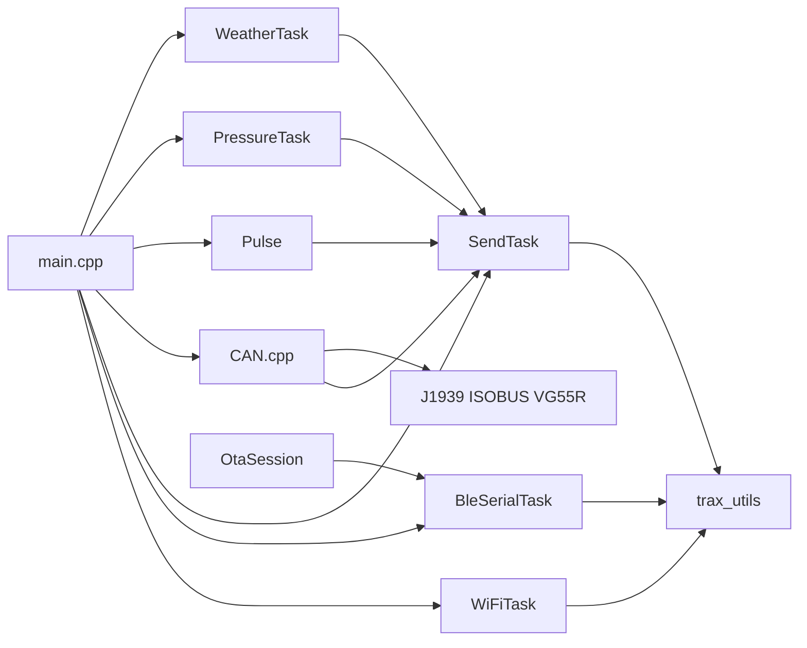
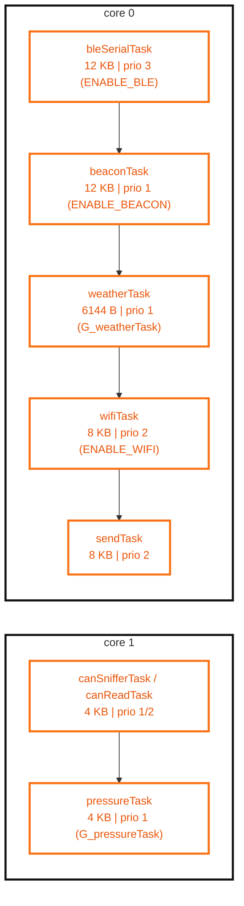

# Arquitectura del firmware

Este documento describe la arquitectura real del firmware segun el codigo actual.

## 1. Vista por capas

1. Entrada y orquestacion
- `src/main.cpp` crea tareas FreeRTOS, inicializa serial/BLE y colas, y decide que tareas se habilitan por flags de compilacion.

2. Adquisicion de datos
- `src/WeatherTask.cpp` (clima + GPS via TRAX)
- `src/PressureTask.cpp` (sensor de presion)
- `src/Pulse.cpp` (contadores por ISR)
- `src/CAN/CAN.cpp` (lectura CAN + parseo de protocolos)
- `src/BeaconTask.cpp` (si `ENABLE_BEACON`)

3. Agregacion y envio
- `src/SendTask.cpp` consulta estados de productores, construye tramas STX con `SendTask*` y envia por `traxSendReceive`.

4. Transporte/puentes
- `src/trax_utils.cpp` encapsula request/response hacia TRAX por serial.
- `src/BleSerialTask.cpp` puente BLE <-> serial y soporte OTA.
- `src/WiFiTask.cpp` puente WiFi <-> serial cuando aplica.

5. OTA
- `lib/OtaSession` implementa la sesion OTA sobre BLE y su protocolo de paquetes.

### 1.1 Contexto Expoagro: simulacion y envio rapido

Para el escenario de Expoagro se habilito un modo de simulacion para acelerar pruebas funcionales sin depender de todos los sensores reales.

En ese modo, el sistema utiliza la ruta de simulacion (`ENABLE_SIMULATION`) y una cola de mensajes para desacoplar la generacion de datos simulados del envio por BLE/serial.

La base de esta estrategia esta en:
- `include/Messanger_queue.h`
- `src/Messanger_queue.cpp`

y su integracion actual principal con:
- `src/SendTask.cpp`
- `src/BleSerialTask.cpp`

## 2. Diagrama de bloques

## 3. Tareas por core

Configuradas en `src/main.cpp`.

### 3.1 Diagrama visual de asignacion por core

Stacks tomados de las llamadas `xTaskCreatePinnedToCore(...)` en `src/main.cpp`.

### Core 0
- `bleSerialTask` (si `ENABLE_BLE`) prioridad 3, stack 12288
- `beaconTask` (si `ENABLE_BEACON`) prioridad 1, stack 12288
- `weatherTask` (si `G_weatherTask`) prioridad 1, stack 6144
- `wifiTask` (si `ENABLE_WIFI`) prioridad 2, stack 8192
- `sendTask` prioridad 2, stack 8192

### Core 1
- `canSnifferTask` (si `ENABLE_CAN_SNIFFER`) prioridad 1, stack 4096
- `canReadTask` (si no hay sniffer y `G_cantask`) prioridad 2, stack 4096
- `pressureTask` (si `G_pressureTask`) prioridad 1, stack 4096

## 4. Flujo de datos salientes (actual)

Patron principal actual:

`Productor -> estado protegido (mutex + seq) -> SendTask (poll cada 500 ms) -> traxSendReceive -> serial`

Productores y periodos observados:
- Weather: ciclo de 2000 ms
- Pressure: ciclo de 3000 ms
- Pulse: ventana de 2000 ms
- CAN: evento por frame + polling/INT
- Beacon: segun tarea de escaneo (opcional)

`SendTask` valida cambios por `seq` y por ventanas de tiempo por tipo de dato.

### 4.1 Como se conectan los modulos

1. Un modulo productor toma datos de hardware o bus (Weather, Pressure, Pulse, CAN, Beacon).
2. El productor actualiza estado compartido y secuencia local.
3. `SendTask` consulta contratos `getData(out, seq)`, valida cambios y frescura.
4. `SendTask` arma mensajes STX segun tipo de dato.
5. `trax_utils` serializa acceso a UART y ejecuta request/response con TRAX.
6. BLE y WiFi actuan como puentes de transporte, y OTA ingresa por BLE.

## 5. Sincronizacion y concurrencia

Mecanismos actuales usados:
- Mutex por modulo para estado de datos (`weatherMutex`, `pressureMutex`, etc.)
- Semaforo binario para RX CAN por interrupcion (`g_canRxSemaphore`)
- Semaforo global UART en `trax_utils.cpp` para serializar escrituras a TRAX
- Atomicos para conteo de pulsos en ISR (`Pulse.cpp`)

Riesgos actuales conocidos:
- `SendTask` es cuello de botella del envio
- timeout de mutex de 5 ms puede perder actualizaciones bajo carga
- envio a TRAX bloqueante por espera de respuesta

## 6. Mapa de modulos clave

- `src/main.cpp`: lifecycle y creacion de tareas
- `src/SendTask.cpp`: politica de envio y secuencias
- `src/trax_utils.cpp`: canal request/response con TRAX
- `src/BleSerialTask.cpp`: puente BLE y OTA runtime
- `src/CAN/CAN.cpp`: MCP2515 + distribucion a parsers
- `src/CAN/CAN_protocols/j1939_protocol.cpp`: J1939
- `src/CAN/CAN_protocols/isobus_protocol.cpp`: ISOBUS y simulacion
- `src/Pulse.cpp`: ISR + conversion a tasas
- `src/Messanger_queue.cpp`: colas FreeRTOS builder/sender (uso parcial actual)

Detalle por modulo:
- [07_modules_explained.md](07_modules_explained.md)

## 7. Principios operativos para mantenimiento

- Cualquier productor nuevo debe definir contrato `getData(out, seq)` o equivalente.
- Cualquier mensaje nuevo debe documentar formato y timeout de frescura.
- Evitar escrituras directas a serial fuera de `traxSendReceive` para no romper exclusiones.
