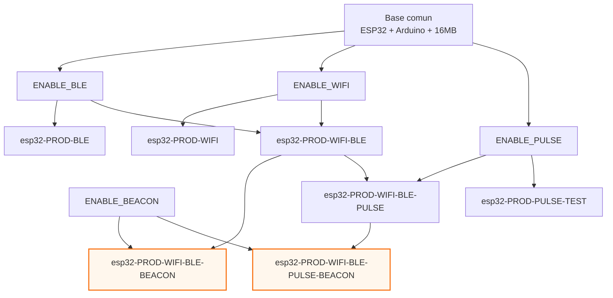

# Build, deploy y test

Guia operativa reproducible basada en `platformio.ini`, scripts y tests incluidos en el repo.

## 1. Requisitos

- PlatformIO CLI o extension de VS Code
- Referencia oficial PlatformIO: https://platformio.org/
- Python 3.9+ para scripts en `scripts/`
- Dependencias Python de `requirements.txt`
- ESP32 conectado por USB para upload/monitor

Instalacion sugerida:

```bash
pip install -r requirements.txt
```

## 2. Entornos PlatformIO (reales)

`default_envs = esp32-PROD-BLE`

Todos los entornos definidos en `platformio.ini` comparten base comun:

> [!WARNING]
> Esta guia asume `ota_spiffs_16MB.csv` y flash de 16MB.
> Si el modulo ESP32 es de 4MB, puede haber fallos de arranque, OTA o particiones.
> Validar el tamano real de flash antes de desplegar.

- board: `nodemcu-32s`
- framework: `arduino`
- monitor: `115200`
- particiones: `ota_spiffs_16MB.csv`
- flash: `16MB`
- dependencias base: MCP2515 + ESP32_BleSerial

### 2.1 Convencion de nombres

- `esp32-PROD-*`: orientado a uso productivo.
- `esp32-DEB-*`: orientado a pruebas/debug.

Regla practica:
- Si no sabes cual usar, arrancar con `esp32-PROD-BLE`.

### 2.2 Entornos de produccion

1. `esp32-PROD-BLE`
- Flags: `-DENABLE_BLE=1`
- Uso: firmware base con BLE (CAB).

2. `esp32-PROD-WIFI`
- Flags: `-DENABLE_WIFI=1`
- Uso: despliegues donde el canal principal es WiFi.

3. `esp32-PROD-WIFI-BLE`
- Flags: hereda de WiFi y BLE.
- Efectivo: `-DENABLE_WIFI=1 -DENABLE_BLE=1`
- Uso: operación híbrida con ambos transportes.

4. `esp32-PROD-WIFI-BLE-BEACON`
- Flags: hereda de `esp32-PROD-WIFI-BLE` + `-DENABLE_BEACON=1`
- Uso: cuando además se requiere reporte de beacons.

5. `esp32-PROD-WIFI-BLE-PULSE`
- Flags: hereda de `esp32-PROD-WIFI-BLE` + `-DENABLE_PULSE=1`
- Uso: cuando se necesita muestreo de pulsos.

6. `esp32-PROD-WIFI-BLE-PULSE-BEACON`
- Flags: hereda de `esp32-PROD-WIFI-BLE-PULSE` + `-DENABLE_BEACON=1`
- Uso: perfil full (WiFi + BLE + Pulse + Beacon).

7. `esp32-PROD-PULSE-TEST`
- Flags: `-DENABLE_PULSE=1`
- Uso: prueba enfocada en lector de pulsos.

> [!CAUTION]
> Actualmente `esp32-PROD-WIFI-BLE-BEACON` y `esp32-PROD-WIFI-BLE-PULSE-BEACON` no son estables.
> Teorias en analisis: `memory leak` o `heap fragmentation`.
> Hasta resolverlo, evitar estos entornos en escenarios productivos.

### 2.3 Entornos de debug/testing

1. `esp32-DEB-CAN-SNIFFER-SOLO`
- Flags: `-DENABLE_CAN_SNIFFER=1`
- Uso: medir bus CAN en condiciones casi ideales (sin resto de carga funcional).

2. `esp32-DEB-CAN-SNIFFER-ALL`
- Flags: `-DENABLE_CAN_SNIFFER=1 -DENABLE_WIFI=1 -DENABLE_BLE=1`
- Uso: medir CAN bajo carga mas realista (sniffer + comunicaciones activas).

3. `esp32-DEB-WIFI-LIGHT-DEBUG`
- Flags: `-DENABLE_WIFI=1 -DDEBUG_WIFI=1`
- Uso: diagnostico de conectividad WiFi.

4. `esp32-DEB-WEATHER-SIM`
- Flags: `-DENABLE_BLE=1 -DENABLE_WIFI=1 -DENABLE_SIMULATION=1`
- Uso: simulacion de datos (util para demos y pruebas rapidas, por ejemplo Expoagro).

> [!NOTE]
> `esp32-DEB-WEATHER-SIM` es para simulacion y demos.
> No usar este entorno como referencia de comportamiento de produccion.

### 2.4 Entorno pendiente en roadmap

En `platformio.ini` existe un TODO para crear un entorno combinado de CAN + BLE + WiFi dedicado.

Mientras no exista ese entorno explicitamente, usar `esp32-DEB-CAN-SNIFFER-ALL` o crear uno nuevo segun necesidad del escenario.

### 2.5 Mapa visual de entornos y flags



## 3. Comandos base

Build:

```bash
pio run
pio run -e esp32-PROD-WIFI-BLE
```

Build por entorno especifico:

```bash
pio run -e esp32-PROD-BLE
pio run -e esp32-DEB-CAN-SNIFFER-SOLO
pio run -e esp32-DEB-WEATHER-SIM
```

Upload:

```bash
pio run --target upload -e esp32-PROD-BLE --upload-port COM7
```

Upload cambiando entorno:

```bash
pio run --target upload -e esp32-PROD-WIFI-BLE --upload-port COM7
```

Monitor:

```bash
pio device monitor -e esp32-PROD-BLE --port COM7
```

Monitor cambiando entorno:

```bash
pio device monitor -e esp32-DEB-WIFI-LIGHT-DEBUG --port COM7
```

Limpieza:

```bash
pio run --target clean -e esp32-PROD-BLE
```

## 4. OTA por BLE

Archivos relevantes:
- `scripts/ble_ota.py`
- `scripts/get_hash.py`
- `scripts/retrieve_hash.py`
- `lib/OtaSession/README.md`

Flujo recomendado:

1. Compilar firmware
```bash
pio run -e esp32-PROD-BLE
```

2. Calcular hash del binario
```bash
python scripts/get_hash.py .pio/build/esp32-PROD-BLE/firmware.bin
```

3. Ejecutar cliente OTA
```bash
python scripts/ble_ota.py
```

Notas:
- `ble_ota.py` usa `OTA_PACKET_SIZE = 480`
- handshake OTA definido como `>OTA12345678<`

## 5. Pruebas

Pruebas nativas locales:
- `native_test/run_tests.sh` compila y ejecuta `base64_test.cpp`

```bash
cd native_test
bash run_tests.sh
```

Pruebas PlatformIO:

```bash
pio test -e esp32-PROD-BLE
```

## 6. Analisis estatico de codigo (mejora futura)

Estado actual:
- No esta integrado en este proyecto.

Referencia:
- PlatformIO Static Code Analysis: https://docs.platformio.org/en/latest/advanced/static-code-analysis/index.html

Por que conviene incorporarlo a futuro:
- Detecta errores potenciales antes de runtime.
- Ayuda a encontrar puntos de falla en rutas criticas.
- Aporta una capa de calidad adicional sobre `pio test`.

Primer flujo sugerido para evaluacion futura:

```bash
pio check -e esp32-PROD-BLE
```

Notas:
- `pio test` valida pruebas funcionales.
- `pio check` analiza codigo estaticamente y no reemplaza a las pruebas.

## 7. Troubleshooting rapido

> [!TIP]
> Diagnostico rapido recomendado:
> 1. `pio run -e <entorno>`
> 2. `pio run --target upload -e <entorno> --upload-port COMx`
> 3. `pio device monitor -e <entorno> --port COMx`

1. Error de entorno no encontrado
- Validar nombre exacto con `platformio.ini`.
- Nota: los nombres validos son `esp32-PROD-*` y `esp32-DEB-*`.

2. Upload no conecta
- Verificar `COMx` correcto con `pio device list`.

3. Sin respuesta en monitor
- Confirmar `monitor_speed = 115200`.

4. OTA lenta o inestable
- Reducir interferencia BLE cercana
- Revisar recomendacion de timeout/interrupcion en `lib/OtaSession/README.md`

## 8. Checklist de release tecnica

- Build limpio del entorno objetivo
- Upload y arranque correctos
- Verificacion de telemetria esperada por serial/BLE
- Si hay OTA: hash calculado y prueba OTA completada
- Si hay CAN: validar frames y parseo en entorno de prueba
