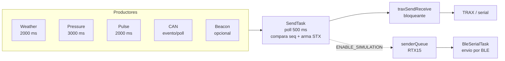

# Flujo actual de mensajeria (estado presente)

Este documento describe como funciona hoy el envio de mensajes para establecer una linea base tecnica previa a la cola centralizada.

## 1. Patron vigente

El sistema usa principalmente:

`Productor -> estado local protegido (mutex + seq) -> SendTask (poll 500 ms) -> traxSendReceive`

No hay queue central obligatoria para todos los mensajes salientes.

### 1.1 Caso Expoagro: simulacion con cola para envio rapido

Para Expoagro se implemento un modo de simulacion orientado a pruebas rapidas de punta a punta.

En ese escenario:
- `SendTask` genera mensajes simulados (ejemplo RTX15) y los encola.
- `BleSerialTask` consume esa cola y los envia por BLE sin bloquear el resto del flujo.

Este mecanismo permite acelerar demostraciones y validaciones cuando no se dispone de todo el hardware real en campo.

### 1.2 Diagrama del flujo operativo actual

## 2. Productores y contratos

Cada productor mantiene su propio estado y numero de secuencia.

## 2.1 Weather
- `src/WeatherTask.cpp`
- publica `weatherGetData(WeatherData& out, uint32_t& seq)`
- mutex local + `weatherSeq`
- ciclo nominal: 2000 ms

## 2.2 Pressure
- `src/PressureTask.cpp`
- publica `pressureGetData(...)`
- mutex local + `pressureSeq`
- ciclo nominal: 3000 ms

## 2.3 Pulse
- `src/Pulse.cpp`
- publica `pulseGetData(...)`
- ISR con atomicos + mutex de estado + `pulseSeq`
- ventana nominal: 2000 ms

## 2.4 CAN (J1939, ISOBUS, VG55R)
- `src/CAN/CAN.cpp` y `src/CAN/CAN_protocols/*`
- publica `j1939GetData`, `isobusGetData`, `canGetVg55rData`
- mutex por modulo + seq por modulo

## 2.5 Beacon
- `src/BeaconTask.cpp`
- publica `beaconGetData(...)`
- activo solo con `ENABLE_BEACON`

## 3. Agregacion y envio

`src/SendTask.cpp`:
- periodo principal de 500 ms
- orden de procesamiento actual: ISOBUS -> Weather -> Pulse -> Beacon -> Pressure -> J1939 -> VG55R
- compara secuencia actual vs ultima secuencia enviada
- construye mensajes STX con `SendTask*`
- envia con `traxSendReceive` y considera exito si hay respuesta no vacia

## 4. Uso actual de Messanger_queue

`include/Messanger_queue.h` y `src/Messanger_queue.cpp` definen dos colas:
- builder queue
- sender queue

Uso efectivo hoy:
- inicializacion global en `src/main.cpp` con `MessangerQueue_init()`
- `senderQueue` usada en simulacion para RTX15 (`ENABLE_SIMULATION`)
- `builderQueue` sin uso funcional en el path principal

### 4.1 Implementacion de colas: punto de partida recomendado

Si se quiere implementar una arquitectura de colas mas amplia, el punto de entrada correcto es concentrar la logica en:
- `include/Messanger_queue.h`
- `src/Messanger_queue.cpp`

Con ese enfoque, los cambios en productores/consumidores se vuelven integraciones alrededor de esa API comun (por ejemplo en `SendTask` y `BleSerialTask`), en lugar de duplicar logica de cola en cada modulo.

## 5. Limitaciones observadas

1. Cuello de botella en `sendTask`
- un unico consumidor/dispatcher para todos los productores

2. Envio bloqueante
- `traxSendReceive` espera respuesta hasta timeout

3. Timeout bajo en mutex
- multiples `xSemaphoreTake(..., 5 ms)` pueden descartar lectura bajo carga

4. Sin politicas globales de prioridad/backpressure
- no hay un scheduler de mensajes centralizado

5. Telemetria limitada de perdida
- no hay contador uniforme de drops por tipo

## 6. Implicancias para roadmap

La evolucion a una queue centralizada debe:
- desacoplar productores de la etapa de envio
- definir politicas de prioridad y overflow
- ofrecer metricas de latencia, drop y retry
- mantener compatibilidad gradual con `SendTask` actual
